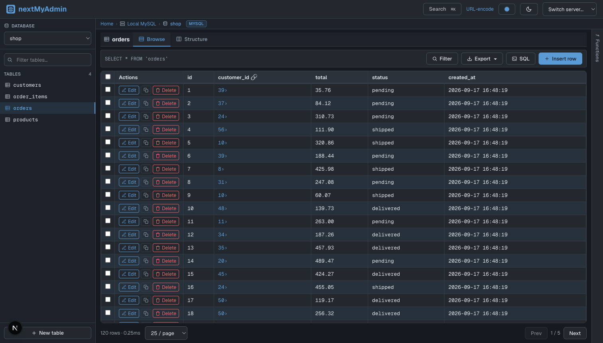
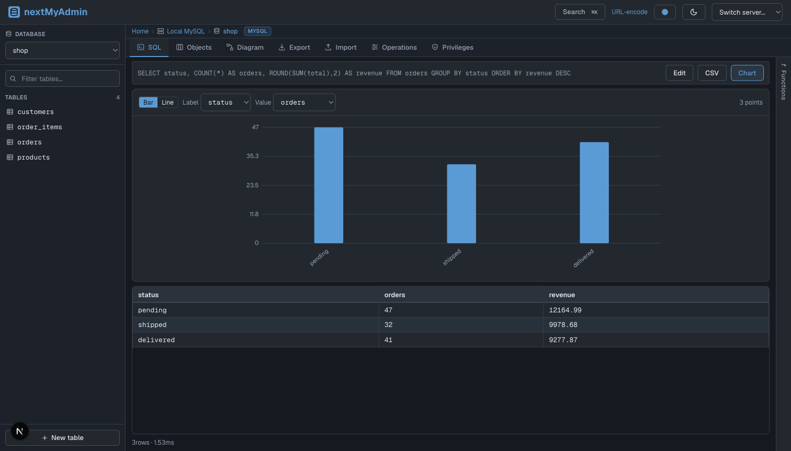
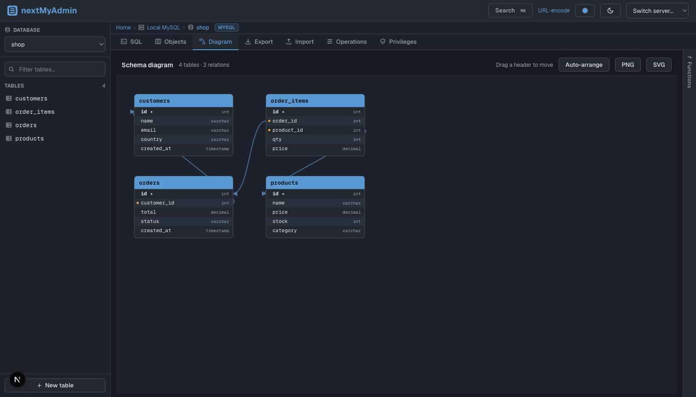

<div align="center">

# nextMyAdmin

### The phpMyAdmin you know — as a fast native desktop app, for five databases, with no server stack to babysit.

Browse, query, edit, and visualize **MySQL · MariaDB · PostgreSQL · SQLite · MongoDB** from one app.


&nbsp;·&nbsp;




</div>

## Why nextMyAdmin?

phpMyAdmin is great — but it's a PHP web app, so running it locally means standing up Apache + PHP + MySQL (hello, XAMPP / WAMP / MAMP), editing `php.ini`, fighting import size limits, and living with a tool that only speaks MySQL.

nextMyAdmin keeps the phpMyAdmin workflow you already know and throws all of that away:

- **No stack to install.** Download, double-click, done. No Apache, no PHP, no ports to configure.
- **Five databases, one app.** MySQL, MariaDB, PostgreSQL, SQLite, and MongoDB — side by side in the same window.
- **It can even start the database for you.** A built-in server manager detects installed engines or downloads one on demand — DBngin-style.
- **Native & cross-platform.** macOS, Windows, and Linux from a single codebase.
- **Local-first.** It runs on your machine and talks straight to your databases. Nothing is hosted, nothing phones home.

## Download

Get the latest installer from the **[Releases page »](https://github.com/GarrianBrown/nextMyAdmin/releases/latest)**

| Platform | Download |
| --- | --- |
| **macOS** (Apple Silicon + Intel) | `nextMyAdmin-*-universal.dmg` |
| **Windows** | `nextMyAdmin.Setup.*.exe` |
| **Linux** | `*.AppImage` or `*.deb` |

> The app is currently unsigned, so the first launch needs one extra click: on macOS **right-click → Open**; on Windows choose **More info → Run anyway**.

## Features

### 🗄️ Browse & edit your data
- Sortable, paginated table browser with per-column **filters**
- **Inline cell editing** — double-click a cell, `Enter` to save, `Esc` to cancel
- Insert, edit, **duplicate**, and delete rows — plus **bulk-select and delete**
- **Clickable foreign keys** jump to the referenced row, and edit forms offer FK value pickers



### ⚡ A SQL console that keeps up
- Editor **docked inline above your results**, phpMyAdmin-style — write, run, see, repeat
- **Autocomplete** for keywords, your tables, and their columns as you type
- **Query history** with one-click re-run
- Turn any result into a **bar or line chart** in a click
- Export results to **CSV**

### 🏗️ Schema tools
- **Create tables visually** — columns, types, primary keys, auto-increment, indexes
- Edit **columns and indexes**; rename, empty, or drop tables
- Manage **Views, Routines & Triggers**
- Export a table as **SQL** (structure + data) or CSV



### 🗺️ Schema diagram (Designer)
- An auto-arranged **ER diagram** of your tables and their foreign-key relationships
- **Drag** boxes to rearrange, then **export as PNG or SVG**

### 🚀 Built-in database server manager
- **Detects** PostgreSQL / MySQL / MariaDB / MongoDB already installed on your machine
- **Downloads** an engine on demand, so a machine with nothing installed can still spin one up
- **Start / stop** isolated local instances — the connection shows up in the app automatically

### 🎨 Made to live in
- **Dark / light / system** themes, plus accent-color presets
- **⌘K command palette** to jump to any database, table, or connection
- A connection manager with **test-before-save**

## Supported databases

| | Browse & CRUD | SQL console | Structure editing | ER diagram | Users | Import / Export |
| --- | :-: | :-: | :-: | :-: | :-: | :-: |
| **MySQL / MariaDB** | ✅ | ✅ | ✅ | ✅ | ✅ | ✅ |
| **PostgreSQL** | ✅ | ✅ | ✅ | ✅ | — | SQL export |
| **SQLite** | ✅ | ✅ | ✅ | ✅ | — | SQL export |
| **MongoDB** | ✅ | — (no SQL) | — | — | — | CSV |

MongoDB maps databases → databases, collections → tables, documents → rows; its "structure" is inferred by sampling documents. Throughout the app, actions an engine doesn't support are simply hidden.

## Run from source

Requires **Node.js 20+**.

```bash
npm install
cp nextmyadmin.config.example.json nextmyadmin.config.json   # add your servers
npm run dev            # then open http://localhost:3000/nextMyAdmin
```

Prefer the desktop window? `npm run electron:dev`.

Your servers live in `nextmyadmin.config.json` (gitignored) — a list of connections, each with an `engine`, host/port/user/password (Postgres also takes an optional `defaultDatabase` and `ssl`; SQLite takes a `directory` or `file`; MongoDB takes a `uri`). See [`nextmyadmin.config.example.json`](nextmyadmin.config.example.json) for the shape. In the packaged app the config lives at a per-user path and starts empty — add connections from the UI.

## Building installers

Each OS builds its own installer natively:

```bash
npm run electron:build    # build for the current OS into dist-electron/
```

Cross-building from one OS to another is unreliable, so [`.github/workflows/release.yml`](.github/workflows/release.yml) builds on macOS, Windows, and Linux runners. Push a `v*` tag and it builds all three — universal `.dmg`, NSIS `.exe`, `.AppImage`, and `.deb` — and publishes them to a GitHub Release automatically.

## Under the hood

**Next.js 16** (App Router) · **React 19** · **TypeScript** · **Tailwind CSS 4** · **Electron**, over a capability-based driver layer in `src/lib/drivers/`. Every engine implements one `DatabaseDriver` interface and declares what it supports, so the routes and UI stay engine-agnostic — adding a database is a single new driver.

```
src/app/api/...       REST routes, one folder per operation
src/app/server/...    UI pages routed by [serverId]/[database]/[table]
src/components/...     Client components (browser, editors, modals, diagram)
src/lib/drivers/...    Per-engine drivers behind the shared DatabaseDriver interface
electron/...           Desktop shell + the local database server manager
```

## Credits

nextMyAdmin began as a minimal, phpMyAdmin-inspired database tool created by **Tony Degidio** — that original project is the foundation everything here is built on. It was then extended into the multi-engine, cross-platform desktop app you see today. Thanks, Tony. 🙌

## License

[MIT](LICENSE) — free to use, modify, and distribute.

---

<div align="center">

**Built for people who miss phpMyAdmin — but not XAMPP.**

</div>
